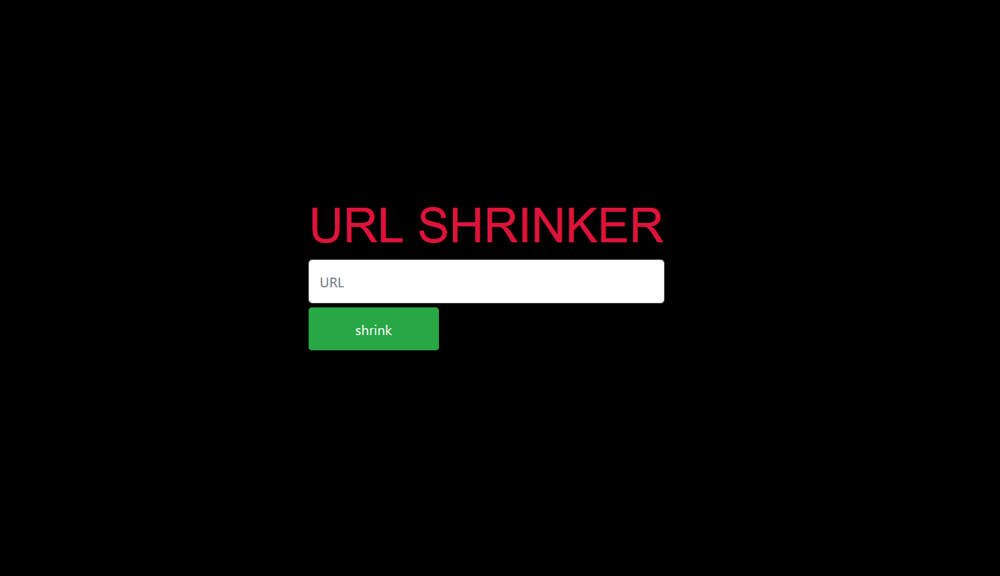

# URL Shortener
made using **Nodejs** and **mongoDB**

## Installation

1-open terminal. 
2-git clone `https://github.com/ahmedmagdy11/URLShortner-NodeJS.git`  
3-`npm install` 

Enjoy~ and also **pull requests** are Welcome 
